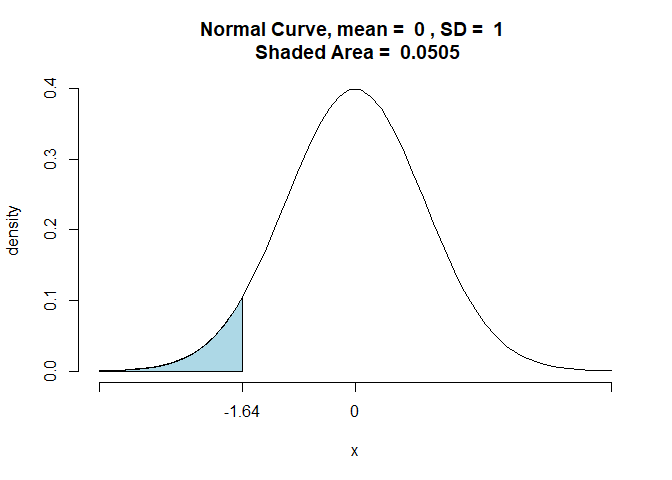

<style type="text/css">
  body{
  font-size: 12pt;
}
</style>


 

```r
packages <- c("tidyverse","stargazer","AER","asbio","tigerstats") ## This is how you define an object (which is a vector here)
install.packages(packages, repos='http://cran.us.r-project.org') # Installing packages at once
lapply(packages, library, character.only = T) # Loading the packages
```

## One Sample Hypothesis Testing
These examples are from the practice problem set provided to the students. 

### Problem 9
**A company claims that its soup machines deliver exactly 10.0 ounces of soup—no more, no less. A researcher samples 100 bowls of soup and finds that:**

$\overline{X}$= 10.28 ounces\
s = 1.20 ounces\
Test the company’s claim at 5% and 1% significance level. 

We denote null hypothesis as $H_{0}$ and alternative hypothesis as $H_{1}$.

$$H_{0} :\mu = 10$$
$$H_{1} :\mu \neq 10$$

We define z-statistic in terms of the sample mean, sample size, and the population standard deviation $\sigma$

$z = \frac{\overline{X} - \mu_{0}}{\bigg(\frac{\sigma}{\sqrt{n}}\bigg)}$ \

We reject the null hypothesis if $|z| \geq |z_{\frac{\alpha}{2}}|$, where $|z|$ is the absolute value of the z-statistic we calculated and $|z_{\frac{\alpha}{2}}|$ is the critical value we obtain from the table. Notice that we use $|z_{\frac{\alpha}{2}}|$ here because we are conducting a two-sided test. \

We reject the null hypothesis if p-value $\leq \frac{\alpha}{2}$, where $\alpha$ is a significance level.(we will often use 0.01,0.05,and 0.1 values for $\alpha$ for our purposes.)


```r
# A function to calculate z scores and compare them with critical values of z (ones we obtain from the table)
z_test <- function(mu,x_bar,s,n,alpha,alternative){
  sd = s/sqrt(n)
  z <- (x_bar - mu)/(sd)
  if(alternative == "two-sided"){
    z_alpha = qnorm((1-alpha/2)) 
  }
  else if(alternative == "less"){
  z_alpha = -qnorm((1-alpha))
  }
  else if(alternative == "greater"){
    z_alpha = qnorm((1-alpha))
  }
  else("NA")
  
  z_list = list("|z_calculated|" = abs(z), "|z_critical|" = abs(z_alpha))
  return(z_list)
}
```

```r
set.seed(21)
Q_9 <- tibble(X = rnorm(mean = 10.28, sd = 0.12, n = 100)) # Our simulated data
z_05 <- z_test(10,10.28,s = 1.2,100,0.05, alternative = "two-sided") ## a two-sided test at 5 % significance level
z_05
```

```
## $`|z_calculated|`
## [1] 2.333333
## 
## $`|z_critical|`
## [1] 1.959964
```

```r
t.test(x = Q_9$X, mu = 10, alternative = "two.sided")
```

```
## 
## 	One Sample t-test
## 
## data:  Q_9$X
## t = 23.422, df = 99, p-value < 2.2e-16
## alternative hypothesis: true mean is not equal to 10
## 95 percent confidence interval:
##  10.26424 10.31316
## sample estimates:
## mean of x 
##   10.2887
```

As we notice here, the absolute value of z-calculated = 2.33 is greater than the absolute value of z-critical = 1.96. Therefore, we reject the null hypothesis being $\mu = 10$


```r
z_01 <- z_test(10,10.28,s = 1.2,100,0.01, alternative = "two-sided") ## a two-sided test at 1 % significance level
z_01
```

```
## $`|z_calculated|`
## [1] 2.333333
## 
## $`|z_critical|`
## [1] 2.575829
```

As we notice above, the absolute value of z-calculated = 2.33 is less than the absolute value of z-critical = 2.58. Therefore,we fail reject the null hypothesis being $\mu = 10$

### Problem - 6

**A manufacturer produces drill bits with an intended life of at least 580 hours and a standard deviation of 30 hours. A quality control scientist draws a sample of 100 bits and finds $\overline{X}=577$. Test at $\alpha =.05$ to see if the machinery needs adjusting.**


$$H_{0} :\mu \geq 580$$
$$H_{1} :\mu < 580$$

<!-- -->


```r
set.seed(121)
Q_6 <- tibble(X = rnorm(mean = 577, sd = 30, n = 100)) # dataset with N ~ (577,900) (it does not have to be normal though. Recall Central Limit Theorem!)
z_one_sided <- z_test(mu = 580, x_bar = 577, s = 30, n = 100, alpha = 0.05, alternative = "less")
z_one_sided
```

```
## $`|z_calculated|`
## [1] 1
## 
## $`|z_critical|`
## [1] 1.644854
```

As we notice above, the absolute value of z-calculated = 1 is less than the absolute value of z-critical = 1.64. Therefore,we fail reject the null hypothesis being $\mu = 580$.


### Problem - 4

**A drug company that manufactures a diet drug claims that those using the drug for 30 days will lose at least 15 pounds. You sample 30 people who have used the drug and find that the average weight loss was 12 pounds with a standard deviation of 5 pounds. (Hint : When sample is small enough i.e. $n \leq 30$ use a t-test). Test the claim at the .05 significance level. **

$$H_{0} :\mu \geq 15$$
$$H_{1} :\mu < 15$$


```r
t_test <- function(mu,x_bar,s,n,alpha,alternative){
  sd = s/sqrt(n)
  t <- (x_bar - mu)/(sd)
  if(alternative == "two-sided"){
    t_alpha = qt(alpha/2,df = n-1)
  }
  else if(alternative == "less"){
    t_alpha = - qt(1-alpha, df= n-1)
  }
  else if(alternative == "greater"){
    t_alpha = qt(1-alpha, df= n-1)
  }
  else("NA")
  
  t_list = list("|t_calculated|" = abs(t), "|t_critical|" = abs(t_alpha))
  return(t_list)
}


t_one_sided <- t_test(15,12,s = 5,n=30,0.05,alternative = "less")

t_one_sided
```

```
## $`|t_calculated|`
## [1] 3.286335
## 
## $`|t_critical|`
## [1] 1.699127
```

```r
z_one_sided <- z_test(15,12,s = 5,n=30,0.05,alternative = "less")
z_one_sided
```

```
## $`|z_calculated|`
## [1] 3.286335
## 
## $`|z_critical|`
## [1] 1.644854
```

```r
pvalt <- 2 * pt(-t_one_sided$`|t_calculated|`,29) # p value calculation
pvalt
```

```
## [1] 0.002658998
```
As we notice above, the absolute value of t-calculated = 3.29 is greater than the absolute value of t-critical = 1.69. Therefore,we reject the null hypothesis being $\mu = 15$.

p-value is here is 0.002 which is less than 0.05. Therefore,we reject the null hypothesis being $\mu = 15$. 
